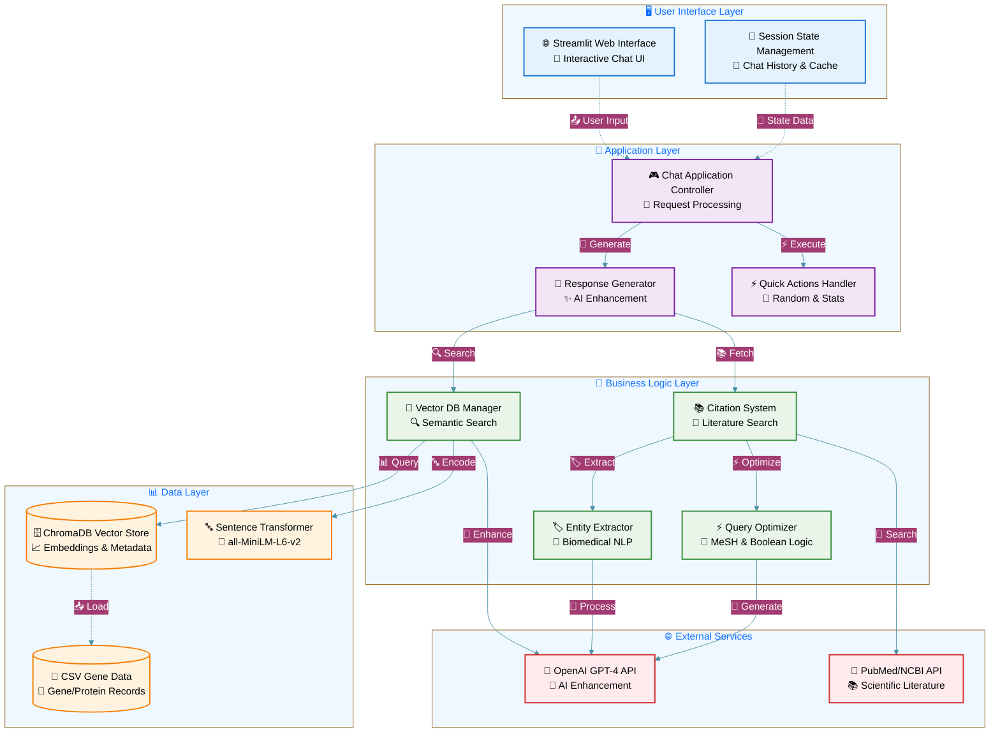
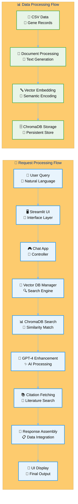
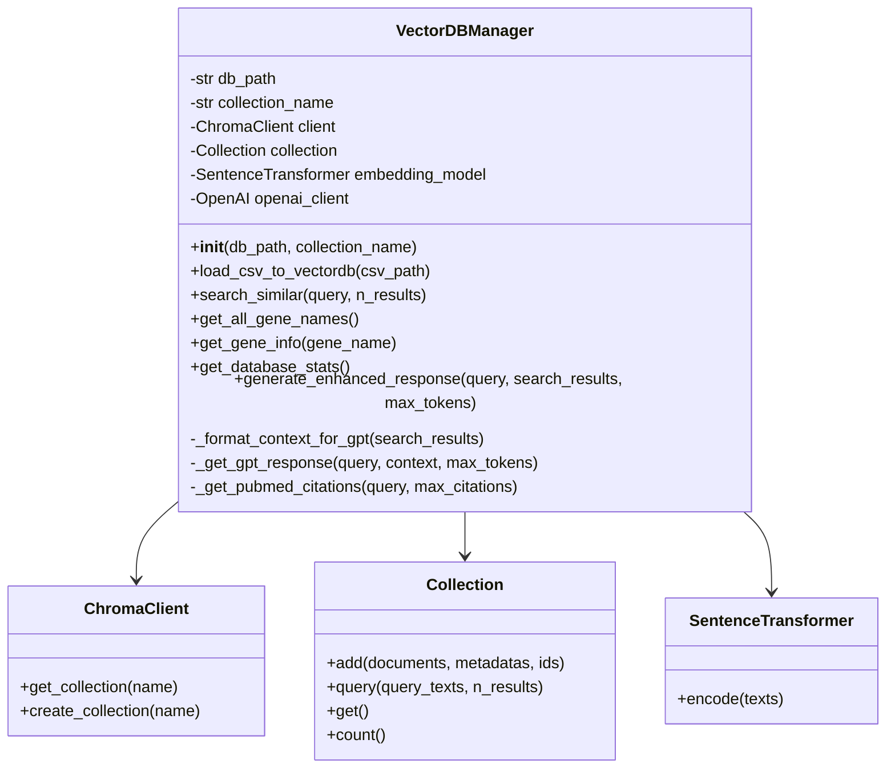
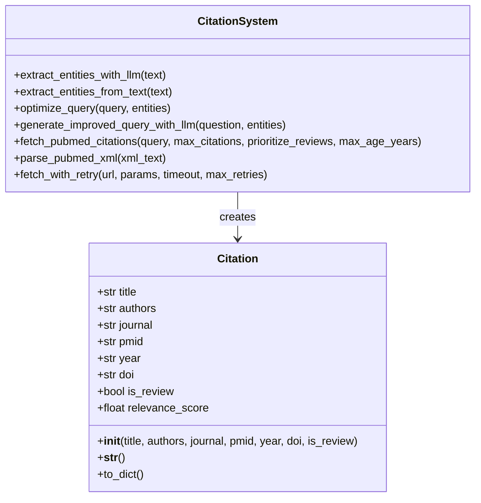
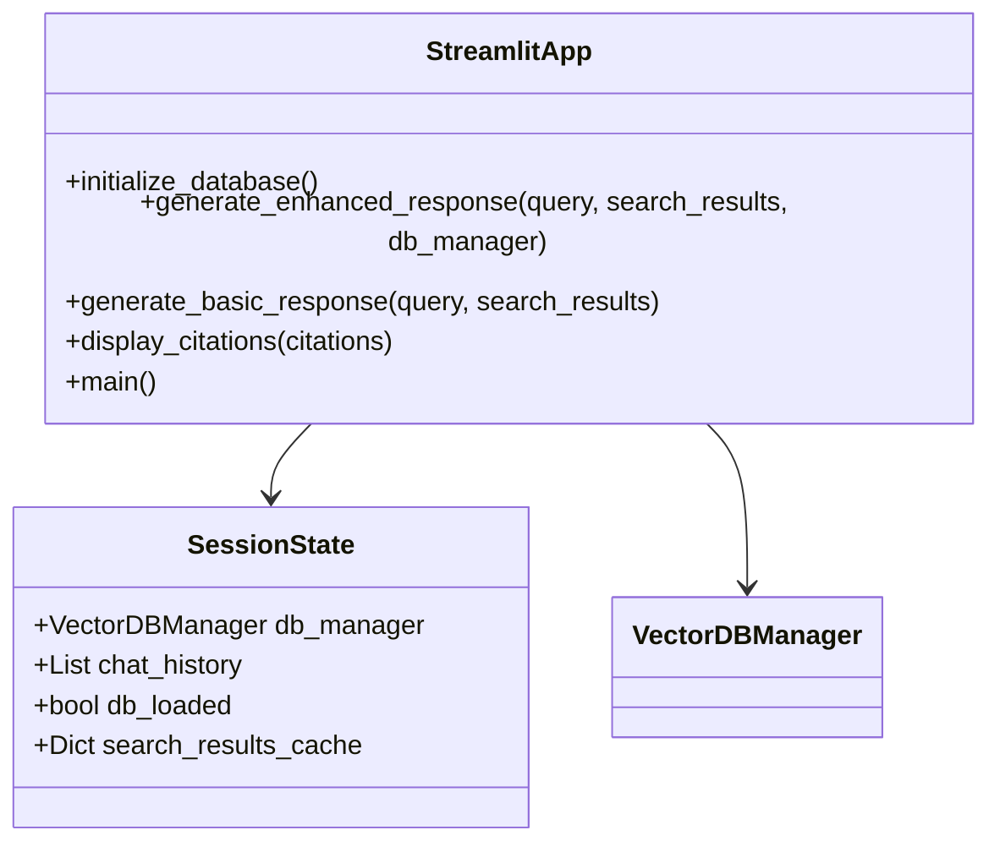
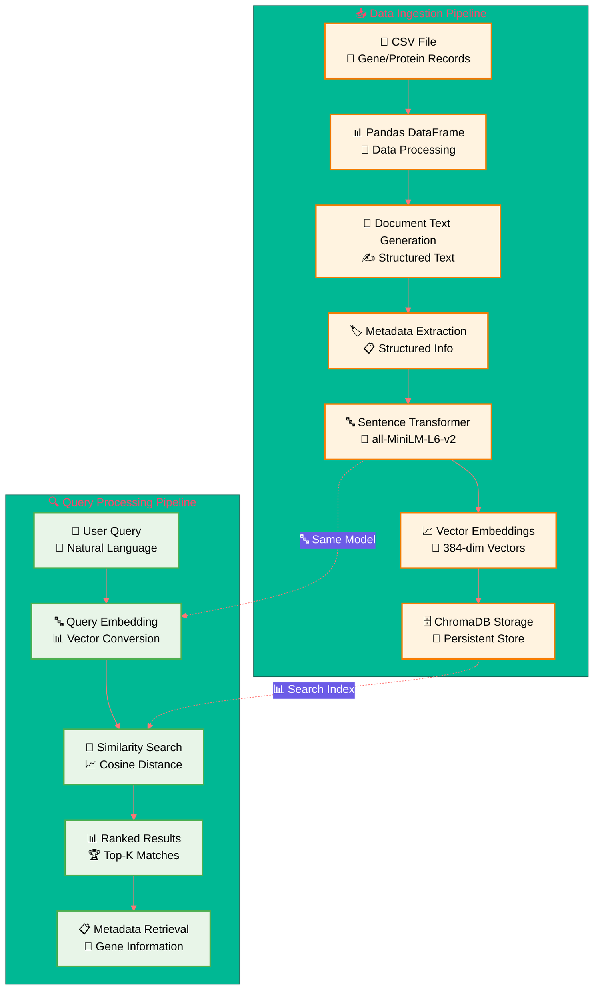

# Gene/Protein Knowledge Chat Application - Low-Level Design (LLD)

## Table of Contents
1. [System Overview](#system-overview)
2. [Architecture Design](#architecture-design)
3. [Component Specifications](#component-specifications)
4. [Class Diagrams](#class-diagrams)
5. [Database Design](#database-design)
6. [API Specifications](#api-specifications)
7. [Configuration Management](#configuration-management)
8. [Error Handling Strategy](#error-handling-strategy)
9. [Security Considerations](#security-considerations)
10. [Performance Optimization](#performance-optimization)
11. [Deployment Architecture](#deployment-architecture)

## System Overview

### Purpose
The Gene/Protein Knowledge Chat Application is a local vector database-powered chat system that enables natural language querying of gene/protein data with AI-enhanced responses and scientific literature citations.

### Key Features
- **Local Vector Database**: ChromaDB with sentence transformer embeddings
- **AI Enhancement**: GPT-4 powered intelligent responses
- **Literature Integration**: Automated PubMed citation fetching
- **Interactive Interface**: Streamlit-based web application
- **Semantic Search**: Advanced similarity matching for biological entities

### Technology Stack
- **Frontend**: Streamlit (Python web framework)
- **Backend**: Python with ChromaDB vector database
- **AI/ML**: OpenAI GPT-4, Sentence Transformers
- **Data Sources**: CSV files, PubMed API
- **Configuration**: JSON config files, environment variables

## Architecture Design

### High-Level Architecture



### Component Interaction Model



## Component Specifications

### 1. Streamlit UI Component (`chat_app.py`)

#### Responsibilities
- User interface rendering and interaction handling
- Session state management
- Chat history maintenance
- Response display and formatting

#### Key Functions
```python
def initialize_database() -> bool
def generate_enhanced_response(query: str, search_results: List[Dict], db_manager: VectorDBManager) -> Dict[str, Any]
def generate_basic_response(query: str, search_results: List[Dict]) -> Dict[str, Any]
def display_citations(citations: List[Citation]) -> None
def main() -> None
```

#### Session State Variables
- `db_manager`: VectorDBManager instance
- `chat_history`: List of (role, message) tuples
- `db_loaded`: Boolean flag for database initialization status
- `search_results_{query_id}`: Cached search results per query

### 2. Vector Database Manager (`vector_db_manager.py`)

#### Responsibilities
- ChromaDB client management
- Document embedding and storage
- Similarity search operations
- GPT-4 integration for enhanced responses
- Database statistics and metadata management

#### Class Structure
```python
class VectorDBManager:
    def __init__(self, db_path: str = "./chroma_db", collection_name: str = "gene_proteins")
    def load_csv_to_vectordb(self, csv_path: str) -> None
    def search_similar(self, query: str, n_results: int = 5) -> List[Dict[str, Any]]
    def get_all_gene_names(self) -> List[str]
    def get_gene_info(self, gene_name: str) -> Dict[str, Any]
    def get_database_stats(self) -> Dict[str, Any]
    def generate_enhanced_response(self, query: str, search_results: List[Dict], max_tokens: int = 1024) -> Dict[str, Any]
    def _format_context_for_gpt(self, search_results: List[Dict]) -> str
    def _get_gpt_response(self, query: str, context: str, max_tokens: int) -> str
    def _get_pubmed_citations(self, query: str, max_citations: int = 5) -> List[Citation]
```

#### Attributes
- `db_path`: Path to ChromaDB storage
- `collection_name`: Name of the document collection
- `client`: ChromaDB persistent client
- `collection`: ChromaDB collection reference
- `embedding_model`: SentenceTransformer model instance
- `openai_client`: OpenAI API client (optional)

### 3. Citation System (`citations.py`)

#### Responsibilities
- PubMed literature search and retrieval
- Biomedical entity extraction from queries
- Query optimization for better search results
- Citation parsing and formatting

#### Key Classes
```python
class Citation:
    def __init__(self, title: str, authors: str = "", journal: str = "", 
                 pmid: str = "", year: str = "", doi: str = "", is_review: bool = False)
    def __str__(self) -> str
    def to_dict(self) -> Dict[str, Any]
```

#### Core Functions
```python
def extract_entities_with_llm(text: str) -> Dict[str, List[str]]
def extract_entities_from_text(text: str) -> Dict[str, List[str]]
def optimize_query(query: str, entities: Optional[Dict[str, List[str]]]) -> str
def generate_improved_query_with_llm(question: str, entities: Dict[str, List[str]]) -> Tuple[str, bool]
def fetch_pubmed_citations(query: str, max_citations: int = 5, prioritize_reviews: bool = True, max_age_years: int = 5) -> List[Citation]
def parse_pubmed_xml(xml_text: str) -> List[Citation]
def fetch_with_retry(url: str, params: Dict[str, Any], timeout: int, max_retries: int) -> requests.Response
```

## Class Diagrams

### VectorDBManager Class Diagram



### Citation System Class Diagram



### Streamlit Application Structure



## Database Design

### ChromaDB Collection Schema

#### Document Structure
```json
{
    "id": "gene_{node_index}",
    "document": "Gene/Protein: {node_name} (ID: {node_id}) - Type: {node_type} - Source: {node_source}",
    "metadata": {
        "node_index": "integer",
        "node_id": "string|integer",
        "node_type": "string",
        "node_name": "string",
        "node_source": "string"
    },
    "embedding": "[768-dimensional vector]"
}
```

#### CSV Data Schema
```csv
node_index,node_id,node_type,node_name,node_source
0,9796,gene/protein,PHYHIP,NCBI
1,7918,gene/protein,GPANK1,NCBI
```

#### Embedding Model Specifications
- **Model**: `all-MiniLM-L6-v2`
- **Dimensions**: 384
- **Max Sequence Length**: 256 tokens
- **Performance**: ~14,000 sentences/second

### Data Flow and Storage



## API Specifications

### Internal API Methods

#### VectorDBManager API

```python
# Database Operations
def load_csv_to_vectordb(csv_path: str) -> None:
    """
    Load CSV data into vector database
    Args:
        csv_path: Path to CSV file
    Raises:
        FileNotFoundError: If CSV file doesn't exist
        ValueError: If CSV format is invalid
    """

def search_similar(query: str, n_results: int = 5) -> List[Dict[str, Any]]:
    """
    Search for similar documents
    Args:
        query: Search query string
        n_results: Number of results to return
    Returns:
        List of dictionaries containing document, metadata, and distance
    """

def get_database_stats() -> Dict[str, Any]:
    """
    Get database statistics
    Returns:
        Dictionary with total_documents, sources, and node_types counts
    """

# Enhanced Response Generation
def generate_enhanced_response(query: str, search_results: List[Dict], max_tokens: int = 1024) -> Dict[str, Any]:
    """
    Generate enhanced response using GPT-4 and citations
    Args:
        query: User query
        search_results: Vector database search results
        max_tokens: Maximum tokens for GPT response
    Returns:
        Dictionary with gpt_response, citations, and metadata
    """
```

#### Citation System API

```python
def fetch_pubmed_citations(query: str, max_citations: int = 5, prioritize_reviews: bool = True, max_age_years: int = 5) -> List[Citation]:
    """
    Fetch PubMed citations for a query
    Args:
        query: Search query
        max_citations: Maximum number of citations
        prioritize_reviews: Whether to prioritize review articles
        max_age_years: Maximum age of articles in years
    Returns:
        List of Citation objects
    """

def extract_entities_with_llm(text: str) -> Dict[str, List[str]]:
    """
    Extract biomedical entities using LLM
    Args:
        text: Input text to analyze
    Returns:
        Dictionary with categorized entities (genes, proteins, diseases, pathways, keywords)
    """

def optimize_query(query: str, entities: Optional[Dict[str, List[str]]]) -> str:
    """
    Optimize query for PubMed search
    Args:
        query: Original query
        entities: Extracted entities (optional)
    Returns:
        Optimized PubMed query string
    """
```

### External API Integrations

#### OpenAI API Integration
```python
# Configuration
MODEL = "gpt-4"
MAX_TOKENS = 1024
TEMPERATURE = 0.1

# System Prompt Template
SYSTEM_PROMPT = """
You are a specialized biomedical AI assistant with access to a curated gene/protein database.
You must provide precise, factual responses based EXCLUSIVELY on the provided database context.

CRITICAL GROUNDING RULES:
1. PRIMARY SOURCE: Use ONLY the gene/protein data provided in the context
2. NO HALLUCINATION: Never invent gene names, functions, or relationships
3. CONTEXT BOUNDARIES: If information isn't in the provided data, state "Not available in current database"
4. GENE NOMENCLATURE: Use exact gene names as they appear in the database
5. REFERENCE NODE IDs: When mentioning genes, include their node_id from the database
"""
```

#### PubMed API Integration
```python
# Base URLs
ESEARCH_URL = "https://eutils.ncbi.nlm.nih.gov/entrez/eutils/esearch.fcgi"
EFETCH_URL = "https://eutils.ncbi.nlm.nih.gov/entrez/eutils/efetch.fcgi"

# Rate Limits
WITH_API_KEY = 10  # requests per second
WITHOUT_API_KEY = 3  # requests per second

# Query Parameters
SEARCH_PARAMS = {
    "db": "pubmed",
    "retmode": "json",
    "sort": "relevance",
    "retmax": 10
}

FETCH_PARAMS = {
    "db": "pubmed",
    "retmode": "xml",
    "rettype": "abstract"
}
```

## Configuration Management

### Environment Variables
```bash
# Required for enhanced features
OPENAI_API_KEY=sk-...
NCBI_API_KEY=your_ncbi_key

# Optional proxy configuration
HTTP_PROXY=http://proxy:port
HTTPS_PROXY=https://proxy:port
```

### Configuration File Structure (`config.json`)
```json
{
    "pubmed": {
        "max_retries": 3,
        "timeout": 10,
        "timeout_short": 10,
        "timeout_long": 15,
        "max_citations": 5
    },
    "citation_extraction": {
        "use_llm_extraction": false,
        "use_llm_query_generation": false,
        "entity_extraction_model": "gpt-4o",
        "query_generation_model": "gpt-4o",
        "extraction_temperature": 0.1,
        "generation_temperature": 0.2,
        "extraction_max_tokens": 500,
        "generation_max_tokens": 500
    },
    "network": {
        "use_proxy": false,
        "http_proxy": "",
        "https_proxy": "",
        "log_network_requests": false
    }
}
```

### Constants and Patterns (`src/constants.py`)
```python
# Regex patterns for entity extraction
GENE_PATTERN = r'\b[A-Z][A-Z0-9]{2,10}\b'
PROTEIN_PATTERN = r'\b(?:protein|receptor|kinase|enzyme)\b'
DISEASE_PATTERN = r'\b(?:disease|syndrome|disorder|cancer|tumor)\b'
PATHWAY_PATTERN = r'\b(?:pathway|signaling|cascade|process)\b'

# Common non-gene terms to filter out
COMMON_NON_GENES = {
    'DNA', 'RNA', 'PCR', 'ATP', 'GTP', 'UDP', 'ADP',
    'USA', 'UK', 'EU', 'WHO', 'FDA', 'NIH'
}

# Query type indicators
QUERY_TYPE_INDICATORS = {
    "gene": ["gene", "genetic", "mutation", "variant", "allele"],
    "protein": ["protein", "enzyme", "receptor", "kinase", "antibody"],
    "disease": ["disease", "syndrome", "disorder", "cancer", "tumor"],
    "pathway": ["pathway", "signaling", "cascade", "process", "metabolic"]
}
```

## Error Handling Strategy

### Exception Hierarchy
```python
class ChatAppException(Exception):
    """Base exception for chat application"""
    pass

class DatabaseException(ChatAppException):
    """Database-related errors"""
    pass

class APIException(ChatAppException):
    """External API errors"""
    pass

class ConfigurationException(ChatAppException):
    """Configuration-related errors"""
    pass
```

### Error Handling Patterns

#### Graceful Degradation
```python
def generate_enhanced_response(query: str, search_results: List[Dict], db_manager: VectorDBManager) -> Dict[str, Any]:
    try:
        # Try enhanced response with GPT-4
        enhanced_result = db_manager.generate_enhanced_response(query, search_results)
        return enhanced_result
    except Exception as e:
        # Fall back to basic response
        st.warning(f"Enhanced response failed, using basic mode: {str(e)}")
        return generate_basic_response(query, search_results)
```

#### Retry Logic with Exponential Backoff
```python
def fetch_with_retry(url: str, params: Dict[str, Any], timeout: int = 10, max_retries: int = 3) -> requests.Response:
    for attempt in range(max_retries):
        try:
            response = requests.get(url, params=params, timeout=timeout)
            response.raise_for_status()
            return response
        except requests.exceptions.RequestException as e:
            if attempt < max_retries - 1:
                backoff = (2 ** attempt) + random.uniform(0, 1)
                time.sleep(backoff)
            else:
                raise
```

#### Logging Strategy
```python
import logging

# Configure logging
logging.basicConfig(
    level=logging.INFO,
    format='%(asctime)s - %(name)s - %(levelname)s - %(message)s',
    handlers=[
        logging.FileHandler("chat_app.log"),
        logging.StreamHandler()
    ]
)

logger = logging.getLogger(__name__)

# Usage examples
logger.info("Database initialized successfully")
logger.warning("OpenAI API key not found, using basic mode")
logger.error(f"Failed to fetch citations: {str(e)}", exc_info=True)
```

## Security Considerations

### API Key Management
- Environment variable storage for sensitive keys
- No hardcoded credentials in source code
- Optional API key validation on startup
- Secure proxy configuration support

### Input Validation
```python
def validate_query(query: str) -> str:
    """Validate and sanitize user query"""
    if not query or not query.strip():
        raise ValueError("Query cannot be empty")
    
    # Limit query length
    if len(query) > 1000:
        raise ValueError("Query too long")
    
    # Basic sanitization
    query = query.strip()
    
    # Remove potentially harmful characters
    query = re.sub(r'[<>"\']', '', query)
    
    return query
```

### Rate Limiting
```python
class RateLimiter:
    def __init__(self, requests_per_second: float):
        self.requests_per_second = requests_per_second
        self.last_request_time = 0
    
    def wait_if_needed(self):
        current_time = time.time()
        time_since_last = current_time - self.last_request_time
        min_interval = 1.0 / self.requests_per_second
        
        if time_since_last < min_interval:
            sleep_time = min_interval - time_since_last
            time.sleep(sleep_time)
        
        self.last_request_time = time.time()
```

### Data Privacy
- Local vector database storage (no cloud dependencies)
- No user query logging to external services
- Optional proxy support for enterprise environments
- Configurable logging levels

## Performance Optimization

### Caching Strategy
```python
# Session-level caching for search results
if f"search_results_{query_hash}" not in st.session_state:
    st.session_state[f"search_results_{query_hash}"] = search_results

# Database-level caching via ChromaDB persistence
# Embeddings are computed once and stored permanently
```

### Lazy Loading
```python
# Database initialization only when needed
if not st.session_state.db_loaded:
    if st.button("Initialize Database"):
        initialize_database()

# Model loading optimization
@st.cache_resource
def load_sentence_transformer():
    return SentenceTransformer('all-MiniLM-L6-v2')
```

### Parallel Processing
```python
# Concurrent citation fetching
def generate_enhanced_response(query: str, search_results: List[Dict]) -> Dict[str, Any]:
    with concurrent.futures.ThreadPoolExecutor() as executor:
        # Submit GPT-4 and citation tasks concurrently
        gpt_future = executor.submit(get_gpt_response, query, context)
        citation_future = executor.submit(get_pubmed_citations, query)
        
        # Collect results
        gpt_response = gpt_future.result()
        citations = citation_future.result()
```

### Memory Management
```python
# Limit chat history size
MAX_CHAT_HISTORY = 50

if len(st.session_state.chat_history) > MAX_CHAT_HISTORY:
    st.session_state.chat_history = st.session_state.chat_history[-MAX_CHAT_HISTORY:]

# Clear old search result caches
def cleanup_old_caches():
    keys_to_remove = [k for k in st.session_state.keys() 
                     if k.startswith("search_results_") and should_cleanup(k)]
    for key in keys_to_remove:
        del st.session_state[key]
```

## Deployment Architecture

### Local Development Setup
```bash
# Install dependencies
pip install -r requirements.txt

# Set environment variables
export OPENAI_API_KEY="your_key_here"
export NCBI_API_KEY="your_key_here"

# Initialize and test
python setup_and_test.py

# Run application
streamlit run chat_app.py
```

### Production Deployment Considerations

#### Docker Configuration
```dockerfile
FROM python:3.9-slim

WORKDIR /app

COPY requirements.txt .
RUN pip install -r requirements.txt

COPY . .

EXPOSE 8501

CMD ["streamlit", "run", "chat_app.py", "--server.port=8501", "--server.address=0.0.0.0"]
```

#### Environment Configuration
```yaml
# docker-compose.yml
version: '3.8'
services:
  chat-app:
    build: .
    ports:
      - "8501:8501"
    environment:
      - OPENAI_API_KEY=${OPENAI_API_KEY}
      - NCBI_API_KEY=${NCBI_API_KEY}
    volumes:
      - ./chroma_db:/app/chroma_db
      - ./data:/app/data
```

#### Scaling Considerations
- **Horizontal Scaling**: Multiple Streamlit instances with shared ChromaDB
- **Load Balancing**: Nginx or similar for request distribution
- **Database Scaling**: ChromaDB clustering for large datasets
- **Caching Layer**: Redis for shared session state and query caching

### Monitoring and Logging
```python
# Application metrics
class MetricsCollector:
    def __init__(self):
        self.query_count = 0
        self.response_times = []
        self.error_count = 0
    
    def record_query(self, response_time: float):
        self.query_count += 1
        self.response_times.append(response_time)
    
    def record_error(self):
        self.error_count += 1
    
    def get_stats(self) -> Dict[str, Any]:
        return {
            "total_queries": self.query_count,
            "avg_response_time": sum(self.response_times) / len(self.response_times) if self.response_times else 0,
            "error_rate": self.error_count / max(self.query_count, 1),
            "uptime": time.time() - self.start_time
        }
```

This comprehensive Low-Level Design document provides detailed specifications for implementing, maintaining, and scaling the Gene/Protein Knowledge Chat Application. It covers all aspects from component architecture to deployment considerations, ensuring robust and maintainable system development.
