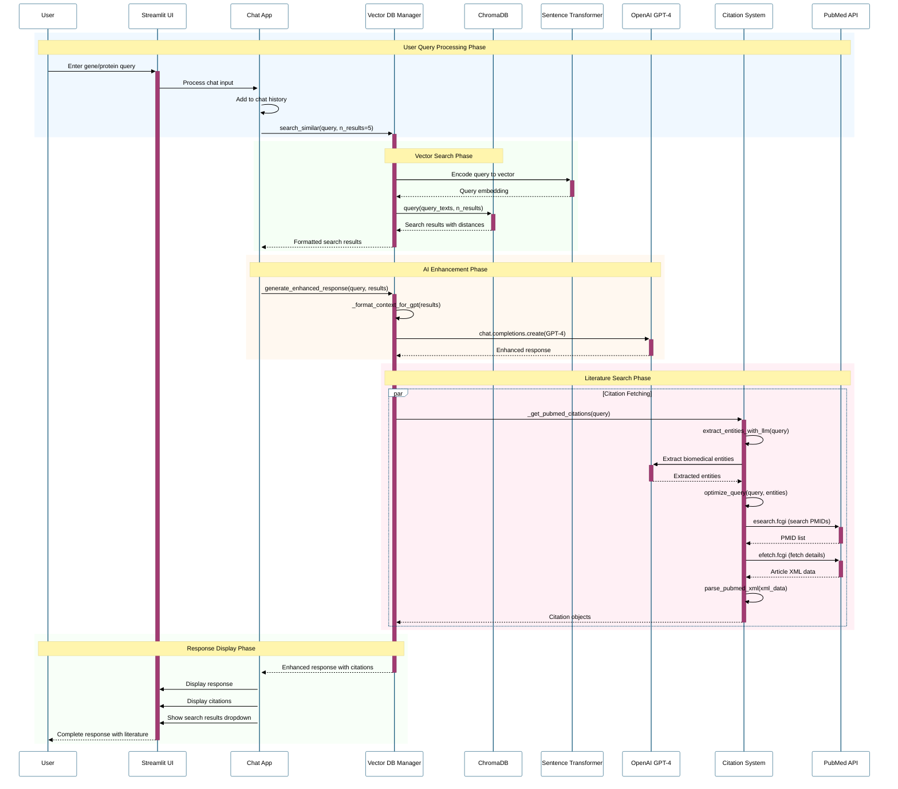
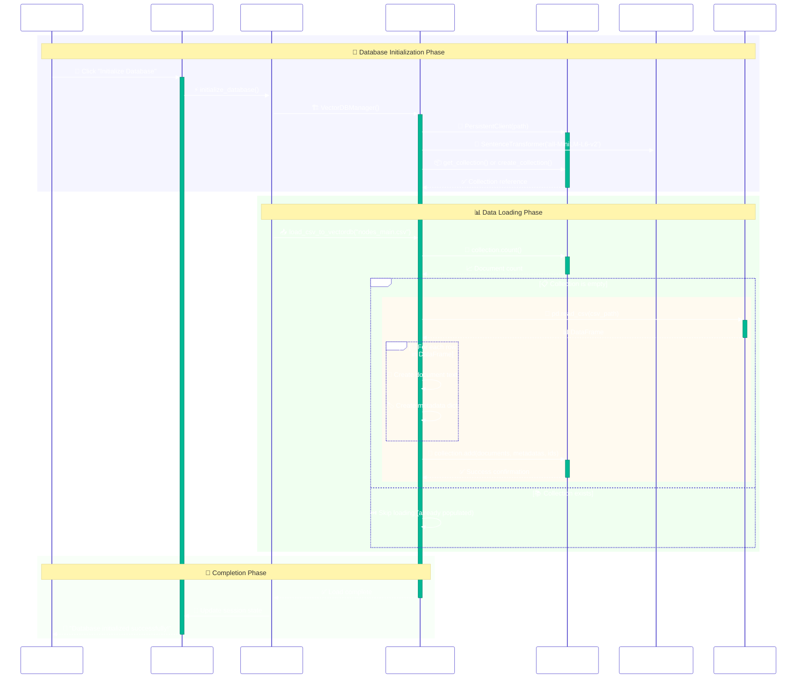
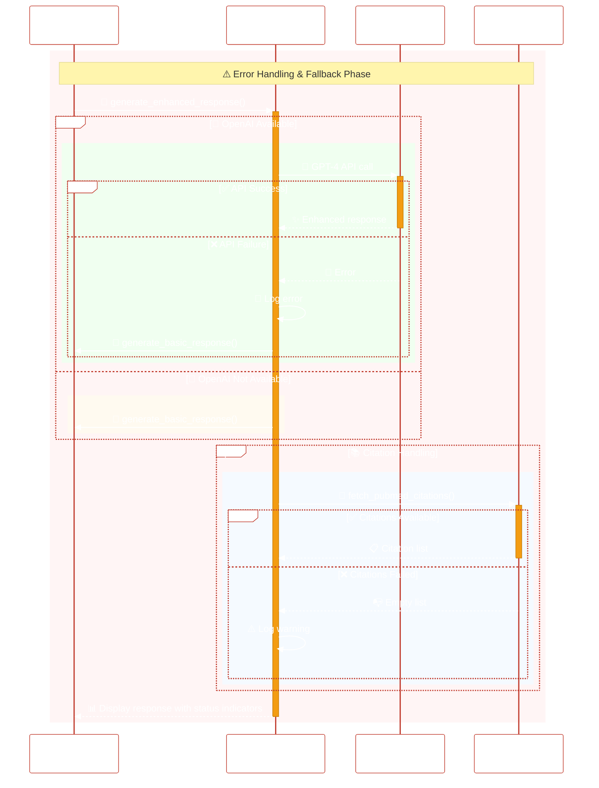
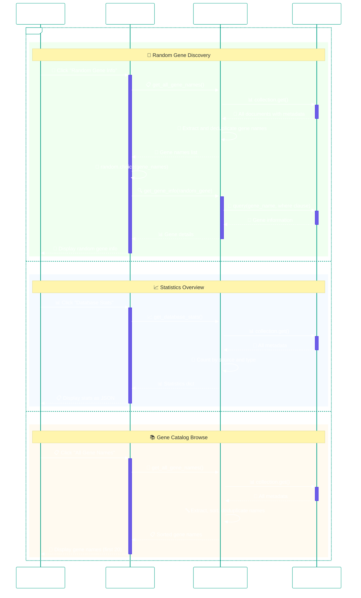
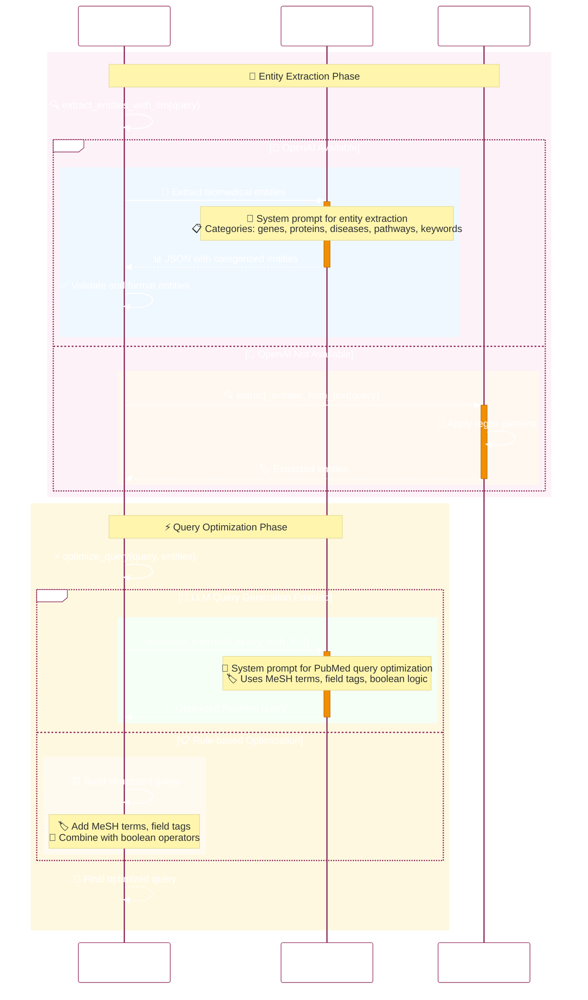
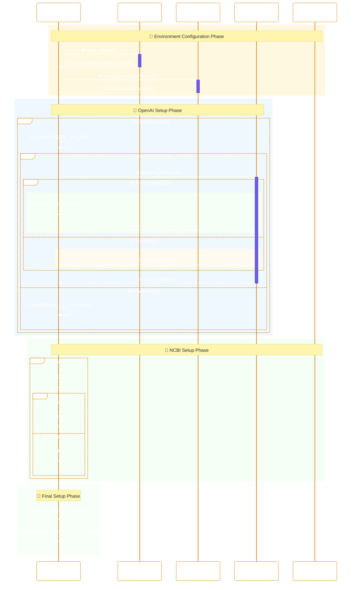

# Gene/Protein Knowledge Chat Application - Sequence Flow Diagram

## Overview
This document presents the sequence flow diagrams for the Gene/Protein Knowledge Chat Application, showing the interactions between users, components, and external services.

## Main Chat Query Flow

## Database Initialization Flow

## Error Handling and Fallback Flow

## Quick Actions Flow

## Entity Extraction and Query Optimization Flow

## Configuration and Environment Setup Flow

## Key Flow Characteristics

### Performance Considerations
- **Caching**: ChromaDB provides persistent storage, avoiding re-computation
- **Rate Limiting**: Different rates for NCBI API based on key availability
- **Parallel Processing**: Citations fetched in parallel with response generation
- **Lazy Loading**: Database initialization only when requested

### Error Resilience
- **Graceful Degradation**: Falls back to basic responses if GPT-4 fails
- **Retry Logic**: Multiple attempts for network requests with exponential backoff
- **Validation**: Input validation and sanitization at multiple levels
- **Logging**: Comprehensive logging for debugging and monitoring

### Security Features
- **API Key Management**: Secure handling of OpenAI and NCBI keys
- **Proxy Support**: Configurable proxy settings for enterprise environments
- **Input Sanitization**: Safe handling of user queries and responses
- **Rate Limiting**: Respects API rate limits to avoid blocking
